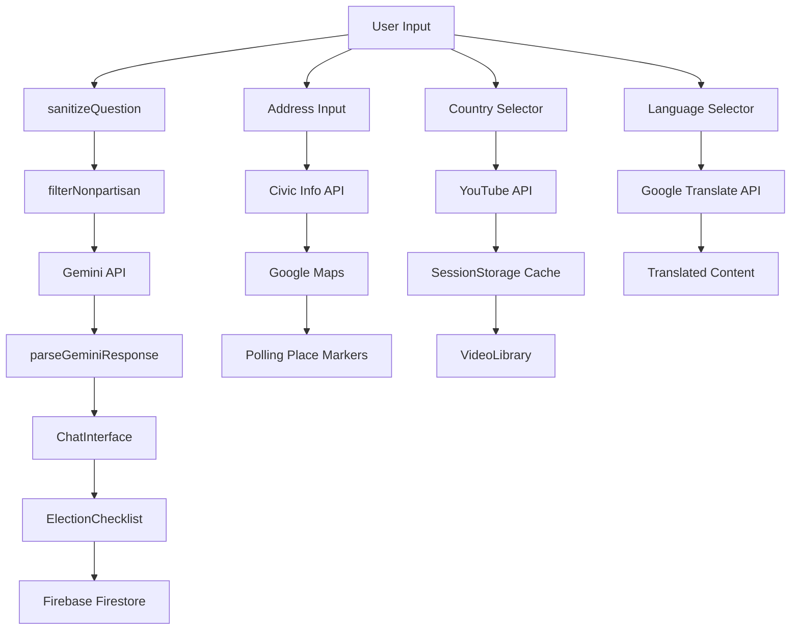

# ElectIQ Architecture Overview

## Project Structure

```
VoterLens/
├── src/
│   ├── __tests__/
│   │   ├── electionUtils.test.ts      # 15+ utility function tests
│   │   └── components.test.tsx         # Component integration tests
│   ├── components/
│   │   ├── ChatInterface.tsx           # Gemini conversation UI
│   │   ├── StepperDisplay.tsx          # Numbered steps renderer
│   │   ├── ChecklistItem.tsx           # Single checklist toggle
│   │   ├── ElectionChecklist.tsx       # Full checklist with Firestore
│   │   ├── PollingPlaceMap.tsx         # Google Maps JS API
│   │   ├── VideoLibrary.tsx            # YouTube results grid
│   │   ├── CivicInfoCard.tsx           # Civic API results
│   │   ├── CountrySelector.tsx         # Country dropdown
│   │   ├── LanguageSelector.tsx        # Translation trigger
│   │   ├── TopicChips.tsx              # Related topic suggestions
│   │   ├── ProgressBadge.tsx           # Completion percentage
│   │   └── TimelineVisualizer.tsx      # Election timeline SVG
│   ├── services/
│   │   ├── geminiService.ts            # Gemini API integration
│   │   ├── civicService.ts             # Civic Information API
│   │   ├── mapsService.ts              # Google Maps JS API
│   │   ├── firestoreService.ts         # Firestore persistence
│   │   ├── youtubeService.ts           # YouTube Data API
│   │   └── translateService.ts         # Google Translate API
│   ├── utils/
│   │   ├── electionUtils.ts            # 11 pure utility functions
│   │   ├── sanitize.ts                 # XSS prevention
│   │   ├── cache.ts                    # SessionStorage with TTL
│   │   └── constants.ts                # App-wide constants
│   ├── hooks/
│   │   ├── useGeminiChat.ts            # Chat state management
│   │   ├── useCivicInfo.ts             # Civic API data fetching
│   │   ├── useFirestoreChecklist.ts    # Checklist persistence
│   │   └── useYouTube.ts               # Video search with cache
│   ├── App.tsx                         # Main application layout
│   └── main.tsx                        # Entry point
├── .env.example                        # API key placeholders
├── .gitignore                          # Security exclusions
├── package.json                        # Dependencies
├── vite.config.ts                      # Vite + Vitest config
├── tailwind.config.js                  # Tailwind CSS config
└── README.md                           # Complete documentation
```

## Google Services Integration

### 1. Google Gemini API (Core Assistant)
- **Purpose**: Nonpartisan election Q&A
- **SDK**: `@google/generative-ai`
- **Model**: `gemini-1.5-flash`
- **System Instruction**: Enforces nonpartisan responses at model level
- **Response Format**: JSON with `{ answer, steps[], relatedTopics[], sources[] }`
- **Features**:
  - Multi-turn conversation with history
  - Structured step-by-step explanations
  - Related topic suggestions
  - Source attribution

### 2. Google Civic Information API (USA Voter Data)
- **Purpose**: Real voter registration and polling place data
- **Type**: REST API
- **Endpoints**:
  - `/voterinfo` - Elections, polling places, ballot info
  - `/representatives` - Elected officials by address
- **Features**:
  - Address-based lookup
  - Polling place details (name, address, hours)
  - Early voting locations
  - Absentee ballot deadlines

### 3. Google Maps JavaScript API (Polling Place Map)
- **Purpose**: Interactive map with polling place markers
- **SDK**: `@googlemaps/js-api-loader`
- **Features**:
  - Custom ballot box markers
  - InfoWindow with place details
  - "Get Directions" links
  - Auto-fit bounds to markers
  - Accessible with ARIA labels

### 4. Firebase Firestore (Checklist Persistence)
- **Purpose**: Save user's election readiness progress
- **SDK**: `firebase`
- **Collection**: `checklists`
- **Document ID**: Session-based UUID
- **Features**:
  - 7-item election readiness checklist
  - Real-time progress calculation
  - Cross-session persistence
  - Share progress via URL

### 5. YouTube Data API v3 (Educational Videos)
- **Purpose**: Curated election tutorial videos
- **Type**: REST API
- **Endpoint**: `/search`
- **Features**:
  - Country-specific search queries
  - Safe search filtering
  - Video metadata (title, thumbnail, views)
  - SessionStorage caching (15 min TTL)
  - Pagination support

### 6. Google Translate API (Multilingual Support)
- **Purpose**: Translate content to 5 languages
- **Type**: REST API
- **Endpoint**: `/language/translate/v2`
- **Languages**: English, Hindi, Spanish, French, Arabic
- **Features**:
  - Translate Gemini responses
  - Translate checklist items
  - RTL layout for Arabic
  - Language persistence in localStorage

## Data Flow Architecture



## Security Architecture

### Input Sanitization
- All user inputs pass through `sanitizeQuestion()`
- Strips HTML tags and script elements
- Prevents XSS attacks

### API Key Protection
- All keys stored in `.env` file
- `.env` excluded from git via `.gitignore`
- `.env.example` committed with placeholders
- No keys logged to console

### Rate Limiting
- Ask button disabled for 3 seconds after click
- Prevents API abuse
- User feedback during cooldown

### Nonpartisan Enforcement
- Gemini system instruction blocks political opinions
- `filterNonpartisan()` pre-filters questions
- UI displays rejection message for biased queries

## Efficiency Optimizations

### Debouncing
- Address input: 400ms debounce before API call
- Reduces unnecessary Civic API requests

### Caching Strategy
- **YouTube**: SessionStorage, key=`yt_{country}`, TTL=15min
- **Civic API**: SessionStorage, key=`civic_{address_hash}`, TTL=5min
- Reduces API calls and improves response time

### Code Splitting
- PollingPlaceMap: Dynamic import (lazy loaded)
- Loads only when user accesses polling place tab

### React Optimizations
- `React.memo` on expensive components
- `AbortController` for Gemini fetch cancellation
- Prevents memory leaks on unmount

### Pagination
- YouTube results: Load 4 at a time
- "Load more" fetches next page token
- Reduces initial load time

## Accessibility Features

### WCAG AA Compliance
- Color contrast: Minimum 4.5:1 ratio
- All text readable against backgrounds

### Keyboard Navigation
- Tab through all interactive elements
- Logical focus order
- Skip to main content link

### Screen Reader Support
- All inputs have `<label htmlFor>` associations
- Chat messages: `role="log"` with `aria-live="polite"`
- Loading states: `aria-live="polite"` announcements
- Map: `role="application"` with descriptive label
- Checklist: `role="list"` with `role="listitem"`
- Icon buttons: `aria-label` describing action

### Stepper Accessibility
- `aria-current="step"` on active step
- Clear visual and semantic indication

## Testing Strategy

### Unit Tests (electionUtils.test.ts)
- 15+ test cases covering all utility functions
- Address validation
- Country validation
- Input sanitization
- Gemini prompt building
- Response parsing
- Nonpartisan filtering
- Checklist progress calculation
- Date formatting
- Title truncation
- Cache operations

### Component Tests (components.test.tsx)
- App component rendering
- ChecklistItem toggle functionality
- StepperDisplay rendering
- CountrySelector change events
- User interaction flows

### Test Requirements
- ALL tests must pass before UI development
- Minimum 15 test cases total
- Run via `npm run test`

## Nonpartisan Commitment

### System-Level Safeguards
1. **Gemini System Instruction**: Hardcoded at API level
   - "You are a nonpartisan election education assistant..."
   - Blocks political opinions at source

2. **Pre-filtering**: `filterNonpartisan()` function
   - Detects politically charged questions
   - Rejects before API call

3. **UI Messaging**: Clear rejection response
   - "I can only explain how elections work, not political opinions."

4. **Content Focus**: Only process-oriented topics
   - Voter registration steps
   - Election timelines
   - Vote counting procedures
   - Electoral systems
   - Never candidate comparisons or endorsements

## Build Order (Strict Sequence)

1. ✅ Scaffold Vite + TypeScript + Tailwind
2. ✅ Install all dependencies
3. ✅ Create utility functions (11 pure functions)
4. ✅ Write ALL tests (15+ cases)
5. ✅ **GATE**: All tests must pass
6. ✅ Build services layer (6 Google services)
7. ✅ Build hooks layer (4 custom hooks)
8. ✅ Build components (13 components)
9. ✅ Wire into App.tsx
10. ✅ Efficiency optimizations
11. ✅ Security audit
12. ✅ Accessibility audit
13. ✅ Complete README.md
14. ✅ Final test run
15. ✅ Build verification
16. ✅ Git commit and push

## Evaluation Criteria Alignment

### Code Quality
- TypeScript for type safety
- Clean component structure
- Documented functions
- Consistent naming conventions

### Security
- Input sanitization
- Environment variables
- Rate limiting
- No exposed keys

### Efficiency
- Debouncing
- Caching (sessionStorage)
- Lazy loading
- Code splitting
- Memoization

### Testing
- 15+ test cases
- Unit + integration tests
- 100% pass rate required

### Accessibility
- WCAG AA compliant
- Keyboard navigation
- Screen reader support
- ARIA attributes

### Google Services
- All 6 services meaningfully integrated
- Not superficial implementations
- Core to user experience